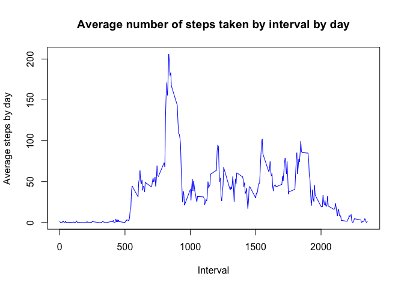
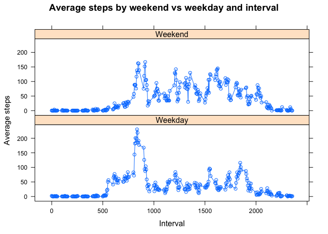

# Reproducible Research Assignment 1
Alan Ault  
16 November 2014  


## Background  

This report is for Reproducible Research assignment 1. 

It analyses data recorded from a personal activity monitoring device, which collects data at 5 minute intervals through out the day. 

The data consists of two months of data from an anonymous individual collected during the months of October and November, 2012 and include the number of steps taken in 5 minute intervals each day.

This report steps through a variety of analysis. The R code which generates the output is included through the document, along with comments which describe the various transformations and analysis taking place.


## 1. Loading and pre-processing the data

Prior to analysis, the data is loaded and prepared ready for analysis


```r
# First, load packages we need
library (lubridate)             # makes working with dates easy
library (dplyr)                 # for data anlaysis
```

```
## 
## Attaching package: 'dplyr'
## 
## The following objects are masked from 'package:lubridate':
## 
##     intersect, setdiff, union
## 
## The following object is masked from 'package:stats':
## 
##     filter
## 
## The following objects are masked from 'package:base':
## 
##     intersect, setdiff, setequal, union
```

```r
library (lattice)               # for trellis type plotting

# set the working directory for the proejct and load data
setwd ("/Users/alanault/Documents/R/Coursera/Repro_research/Project1/")
data <- read.csv ("activity.csv")

# Need to format data.
# Date as date. Interval as ordered factors so we don't lose days and order is preserved
data$date <- ymd (data$date)
data$interval <- as.factor (data$interval)
```


## 2. What is mean total number of steps taken per day?

For this section, we do two tasks, ignoring missing values in the dataset:  
1. Make a histogram of the total number of steps taken each day  
2. Calculate and report the mean and median total number of steps taken per day  


```r
# start by summarising by day
stepsbyday <- group_by (data, date) %>%
                summarise (totalsteps=sum (steps))

# 1. Make a histogram of the total steps by day
hist (stepsbyday$totalsteps,
      xlab="Total steps per day",
      main="Total number of steps per day")
```

 

```r
# 2 Calculate the mean and median
meansteps <- mean (stepsbyday$totalsteps, na.rm=TRUE)
mediansteps <- median (stepsbyday$totalsteps, na.rm=TRUE)

# Report mean and median.
# Round mean so easier to read, as given magnidude, digits aren't necesasry
print (paste ("Mean number of steps taken per day:", 
              round(meansteps, digits=0)))
```

```
## [1] "Mean number of steps taken per day: 10766"
```

```r
print (paste ("Median number of steps taken per day:", mediansteps))
```

```
## [1] "Median number of steps taken per day: 10765"
```


## 3. What is the average daily activity pattern?

For this section, we perform the following:  

1. Make a time series plot (i.e. type = "l") of the 5-minute interval (x-axis) and the average number of steps taken, averaged across all days (y-axis)

2. Which 5-minute interval, on average across all the days in the dataset, contains the maximum number of steps?


```r
# First, summarise by interval, with an average of the total steps
stepsbyinterval <- group_by (data, interval) %>%
                    summarise (averagesteps = mean (steps, na.rm=TRUE))


# 1. Make a time series plot
# We need to wrap interval as a character as it is factor. Otherwise, each point is considered seperately and we won't
# get the line chart - just individual data points, even though we're calling a line graph
plot (as.character(stepsbyinterval$interval), stepsbyinterval$averagesteps, 
      type="l", lty=1, col="blue",
      xlab="Interval", ylab="Average steps by day",
      main="Average number of steps taken by interval by day")
```

 

```r
# 2. Which 5 min interval contains the most steps?
# To do this, we find out the maximum average steps, then use this as an index to find the interval
maxinterval <- stepsbyinterval$interval [which.max(stepsbyinterval$averagesteps)]
# print the output
print (paste ("The 5 minute interval with the maximum number of steps averaged across all days:", maxinterval))
```

```
## [1] "The 5 minute interval with the maximum number of steps averaged across all days: 835"
```


## 4. Imputing missing values

The data has a number of day/intervals which have missing values (NA). This may introduce bias into some of the calculations.  

This section of the report examines the impact of these missing values. Specifically:

1. Calculate the total number of missing values  
2. Devise a strategy for filling in all of the missing values in the dataset  
3. Create a new dataset that is equal to the original dataset but with the missing data filled in
4. Make a histogram of the steps taken each day. Re-calculate the mean and median total number of steps taken per day. Examine whether these differ from those in section 1? What is the impact of imputing missing data on the estimates of the total daily number of steps?


```r
# 1. Calculate the total missing values
missingrows <- nrow (data) - sum (complete.cases (data))
print (paste ("Rows with NA (ie. non-complete):", missingrows))
```

```
## [1] "Rows with NA (ie. non-complete): 2304"
```

**3. Strategy for imputing missing values**  
Missing values from the dataset are replaced using the mean value from the previous analysis performed in section 3. If a value is missing for a specific day/interval, we look up the mean value for that interval and replace the NA value with this average.


```r
# 3.  Strategy for filling in missing values
# We're going to use the mean of each interval to replace each NA
# To do this, we loop through the dataset row by row, checking to see if there's a NA
# If there is, we match the  interval number with that in our mean (average) table we calcualted 

# First, make a copy of dataset, so we still have the original
imputeddata <- data


# Loop through each row and replace NA
for (i in 1:nrow (imputeddata)) {
        # First, check to see if it's not NA. If it isn't, skip to next row
        if (!is.na (imputeddata$steps [i])) {
                next
        }
        # if it is NA, then match the interval with that in our average table
        # use the matched entry to pick the relevant number of average steps from the same average table
        imputeddata$steps [i] <- stepsbyinterval$averagesteps [which (imputeddata$interval [i] == stepsbyinterval$interval)]
}


# 4. histogram of the total steps taken each day from the imputed dataset and analysis

# First, summarise
imputedstepsbyday <- group_by (imputeddata, date) %>%
                        summarise (totalsteps = sum (steps))
        
# Plot histogram        
hist (imputedstepsbyday$totalsteps,
      xlab="Total steps per day",
      main="Total number of steps per day")
```

 

```r
# Calculate mean and median of the imputed data
imputedmeansteps <- mean (imputedstepsbyday$totalsteps)
imputedmediansteps <- median (imputedstepsbyday$totalsteps)
# Report mean and median
# Round mean so easier to read, given magnidude, digits aren't necesasry
print (paste ("Imputed mean number of steps taken per day:", 
              round(imputedmeansteps, digits=0)))
```

```
## [1] "Imputed mean number of steps taken per day: 10766"
```

```r
print (paste ("Imputed median number of steps taken per day:", round(imputedmediansteps, digits=0)))
```

```
## [1] "Imputed median number of steps taken per day: 10766"
```

```r
# Comparison to previous values
# Mean comparison
print (paste ("Original mean:", round (meansteps, digits=0)))
```

```
## [1] "Original mean: 10766"
```

```r
print (paste ("Imputed mean:", round (imputedmeansteps, digits=0)))
```

```
## [1] "Imputed mean: 10766"
```

```r
print (paste ("Difference is:", round (meansteps - imputedmeansteps, digits=0)))
```

```
## [1] "Difference is: 0"
```

```r
# median comparison
print (paste ("Original median", round (mediansteps, digits=0)))
```

```
## [1] "Original median 10765"
```

```r
print (paste ("Imputed median:", round (imputedmediansteps, digits=0)))
```

```
## [1] "Imputed median: 10766"
```

```r
print (paste ("Difference is:", round (mediansteps - imputedmediansteps, digits=0)))
```

```
## [1] "Difference is: -1"
```

It is clear from the small difference that there is little difference in imputing the missing values for the data set. Both the mean and median values hardly change when based on the imputed values.


## 5 Are there differences in activity patterns between weekdays and weekends?

1. Create a new factor variable in the dataset with two levels – “weekday” and “weekend” indicating whether a given date is a weekday or weekend day  
2. Make a panel plot containing a time series plot (i.e. type = "l") of the 5-minute interval (x-axis) and the average number of steps taken, averaged across all weekday days or weekend days (y-axis)


```r
# 1. Create a new factor for weekday and weekend

# Uses the date and ifelse matches sat or sun, then labels as appropriate
# Wrapped as a factor
imputeddata$weekend  <- as.factor (ifelse ((weekdays (imputeddata$date)) %in% c("Saturday", "Sunday"), "Weekend", "Weekday"))

# 2. Make a panel plot

# Rirst create new average, grouped by both interal and weekend factor
weekendstepsbyinterval <- group_by (imputeddata, interval, weekend) %>%
                                summarise (averagesteps = mean (steps))

# So we can plot, we need to turn interval from a factor into a number.
# This is because lattice plots all factors values in the x axis making it unreadable
# Need to coerce to character first, otherwise we get the factor levels
weekendstepsbyinterval$interval <- as.numeric (as.character (weekendstepsbyinterval$interval))

# Lttice plot
xyplot (averagesteps ~ interval | weekend, 
        data=weekendstepsbyinterval, 
        type="o", 
        layout=c(1,2),
        main="Average steps by weekend vs weekday and interval",
        xlab="Interval", ylab="Average steps",
        scales=list (alternating=1)
        )
```

 

There are a number of notable differences between weekend and weekday:  
1. Weekdays is dominated by around 9:00, possibly a commute to work/school    
2. Weekdays have smaller movement during the rest of the day. Possibly due to a static day, perhaps at a desk at work/school  
3. In contrast, the weekend shows a different pattern. Activity is more evenly distributed over the course of the day, suggesting a more active lifestyle at weekends to that during the week
  
  
  
--end of document--


